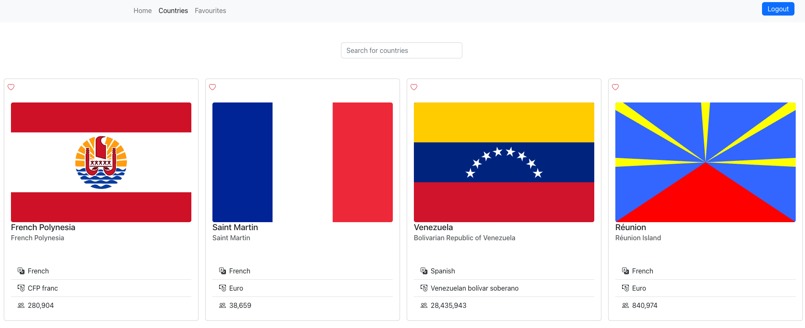
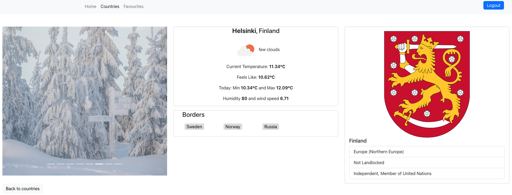
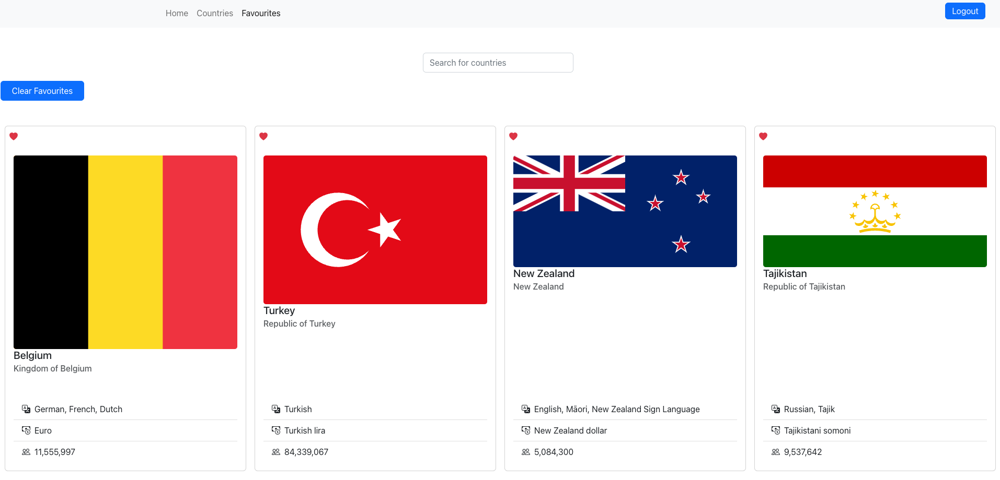

# Country Application
- App that use the rest country api and display the basic information of that country. The open weather api is used to show the basic information of individual country capital. Moreover, the pixaby api is used to display some images of an individual country in carousel. The app has google fire base for user auntentication. User also have an opportunity to add the country they like in a favourite list.

## Technologies stack
- Build with:
- React, CSS, Bootstrap, Google firebase

## Run in your local machine
```
git clone https://github.com/SantoshChapagai/country-project.git
npm install
npm start
```
- You need a api key for weather and images to run the application properly.

## Screen shots




### API
```
Rest country api https://restcountries.com/v3.1/all
Open weather api access with key https://openweathermap.org/
Pixaby api access with key https://pixabay.com/api/docs/
```

### About
- Application has home page, login page, register page, countries, countries/country, and favourites.
- User cannot access to the countries, countries/country, and favourites without login or register.
- The nav bar shows home, login, and register page as well as login button when the user is not login or register.
- Responsive in both bigger and small screen.

### home
- page with hero banner
- Nav bar with nav links
- Link to api pages
- Login or logout button based on the user state

### Login and Register page
- Login page allows the user to login with email and password
- Register page allows user to register with email and password
- Login button on the nav bar also directs to the login page
- Sucessful login or register takes user to the countries page

### Countries page
- Country information is displayed in the Bootstrap card.
- Country flag, name, population, currency, languages are displayed in the card.
- Heart icon in the top of the page allows user to add country to the favourites list.
- Search filed  that sllows the user to search the country they wish.
- Clicking in the card takes the user to the individual country.

### Single country page
- Images are fetch from Pixaby and displayed in the bootstrap carousel
- Weather of the country's capital displayed in the card
- Border of each country are listed in the card
- Clicking in the country displayed in border takes user to that particular country.
- More information of the country is displayed in the bootstrap card along with country code of arms.

### Favourites
- Page that list the all the favourites added by user
- User can search the country from the search field
- There is an option to clear all the country from the clear favourites button
- The country also removed if the user click the heart icon in the country card
